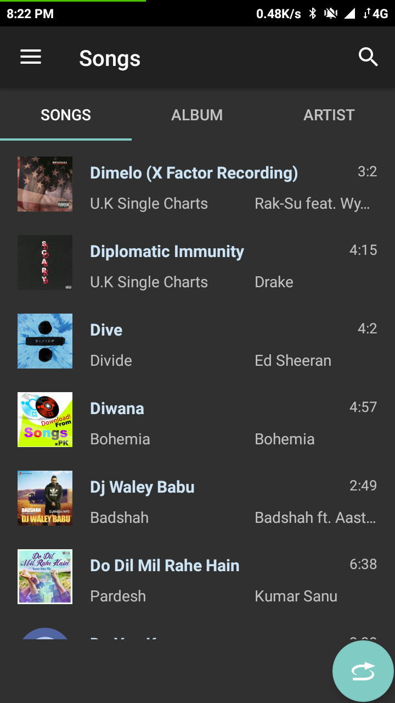
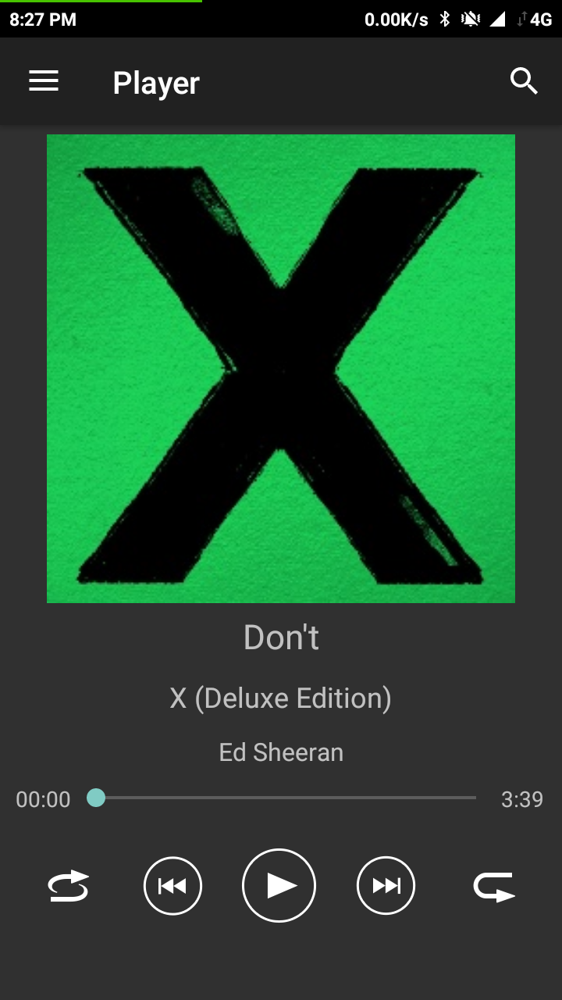
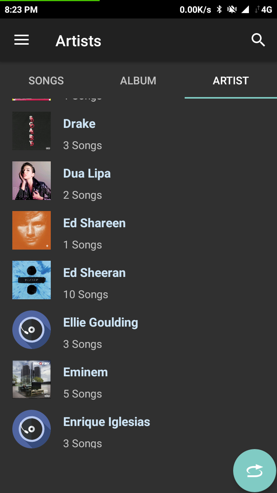
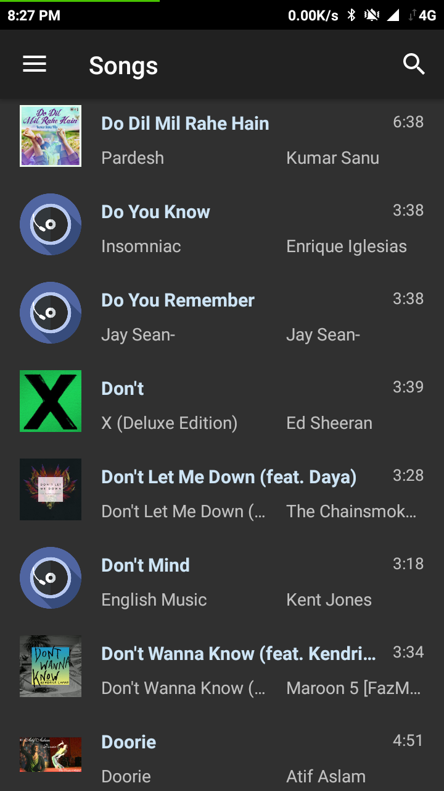
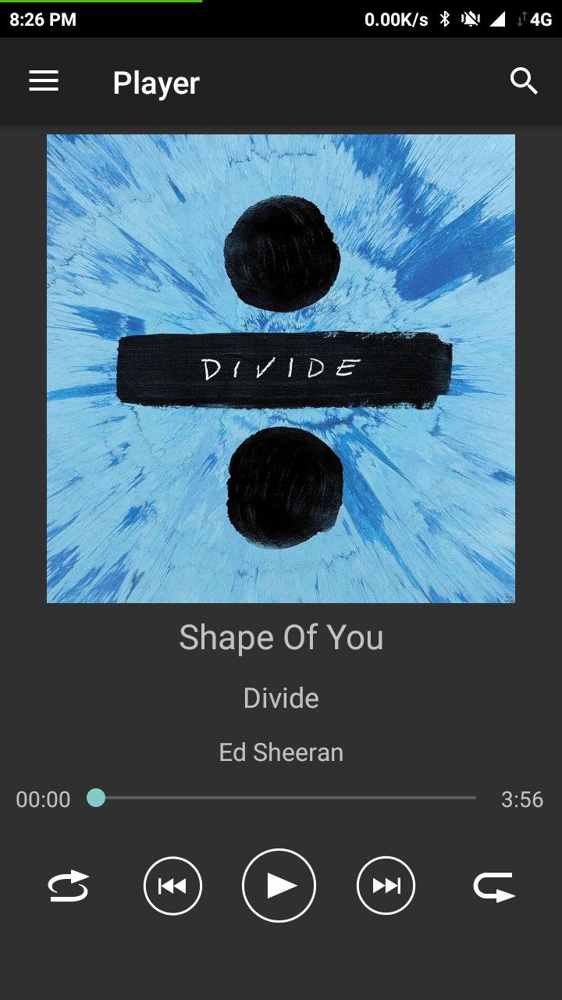
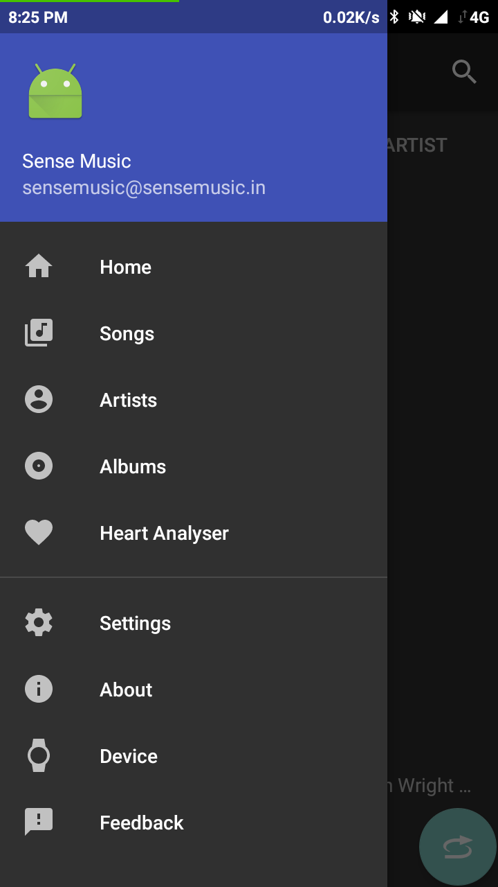

Sense Music Player 
===========================
###### Very simple, slim, nice music player
 

###### Current version: 1.0

Official Website: http://sensemusic.in

The goal of this project is to implement an simple audio media app that works
across multiple form factors and provide a consistent user experience
on Android phones.

# Download

Screenshots
-----------

Features
--------

Release v1.0:
* Simple audio focus management
* Expandable bottom panel
* Clicking "played song info" opens the artist details
* Long click on skip prev button enables repeat song 1x
* Expand the panel to show settings
* Dynamic shuffle 
* System equaliser (if present on the device)
* Dark and light themes + 16 accents
* Enable/disable search bar
* Indicator fast scroll 
* Search bar
* Open audio files from outside the app
* Pause/resume when the headsets are (dis)connected

Coming Soon
- Moduler Application Design with single Activity and swaping fragments.
- Material design with Dark theme.
- Browse Songs, Albums, Artists Fragments
- SearchhView, Player Fragment.

Pre-requisites
--------------

- [Android Studio 3.x](https://developer.android.com/studio/index.html)
- A Java compiler compatible with Java 1.8
- The Android SDK with platform 29 installed which comes default with [Android Studio Bundle](https://developer.android.com/studio/index.html)

Getting Started
---------------

NOTE:- Please read all the .md files before starting.

This app uses the Gradle build system. To build this project, use the
"gradlew build" linux command or use "Import Project" in Android Studio.

Support
-------
email at support@sensemusic.in

If you've found an error in this app, please
[file an issue](https://github.com/SenseMusic/Sense/issues)

Patches are encouraged, and may be submitted by forking this project and
submitting a pull request through GitHub. Please see [CONTRIBUTING.md](CONTRIBUTING.md) for more
details.

License
-------
    Copyright © 2018 Sense Music Inc.
    
    Licensed under the Apache License, Version 2.0 (the "License");
    you may not use this file except in compliance with the License.
    You may obtain a copy of the License at
    
       http://www.apache.org/licenses/LICENSE-2.0
    
    Unless required by applicable law or agreed to in writing, software
    distributed under the License is distributed on an "AS IS" BASIS,
    WITHOUT WARRANTIES OR CONDITIONS OF ANY KIND, either express or implied.
    See the License for the specific language governing permissions and
    limitations under the License.

Copyright © 2018 Sense Music Inc. All Rights Reserved.

